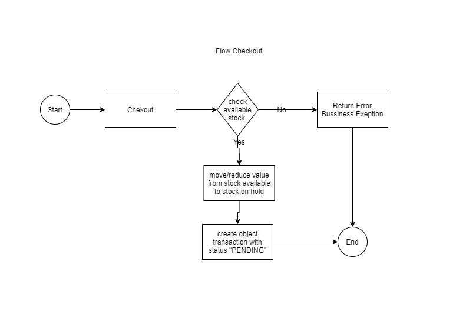

# evermos-test

code architecture

schema database 

how to run 

how to run:
create a database with a free name {databaseName} and the configuration url, usename, and password in folder config/config_db.go 

if there is an error dependency is not found, first download the required dependency.
with syntax: go get {dependency}

If you have finished it .

write the following syntax for build

go build ./app

if the build is complete

write the following syntax for run project

go run ./app

Question :

We are members of the engineering team of an online store. When we look at ratings for our online store application, we received the following
facts:
Customers were able to put items in their cart, check out, and then pay. After several days, many of our customers received calls from
our Customer Service department stating that their orders have been canceled due to stock unavailability.
These bad reviews generally come within a week after our 12.12 event, in which we held a large flash sale and set up other major
discounts to promote our store.
After checking in with our Customer Service and Order Processing departments, we received the following additional facts:
Our inventory quantities are often misreported, and some items even go as far as having a negative inventory quantity.
The misreported items are those that performed very well on our 12.12 event.
Because of these misreported inventory quantities, the Order Processing department was unable to fulfill a lot of orders, and thus
requested help from our Customer Service department to call our customers and notify them that we have had to cancel their orders.
Based on the stated facts above, please do the following things:
Describe what you think happened that caused those bad reviews during our 12.12 event and why it happened. Put this in a section in
your README.md file.
Based on your analysis, propose a solution that will prevent the incidents from occurring again. Put this in a section in your README.md
file.
Based on your proposed solution, build a Proof of Concept that demonstrates technically how your solution will work.

MY Opinion :

Issue :

This problem occurs because transactions occur simultaneously so that there is a clash between request 1 and the other requests while the database has not been fully updated, and there may be something wrong with the stock reduction mechanism, it could be that stock reduction is currently done after the transaction process is complete, before the process is completed. the transaction is done we must first move the product stock from available to stock that has been ordered, so that the stock that has been ordered cannot be taken by other users

Solution :

1. I have a reference that I think is a solution to deal with this problem

https://medium.com/dm03514-tech-blog/golang-introduction-to-race-conditions-for-the-web-engineer-738513ab2ec2

I don't know how to implement this properly but I think it's a workaround for dealing with flashshale where racing conditions are bound to happen

2. and to improve stock reduction

Suppose we have 3 variables below
stock available
stock on hold
out of stock

during user checkout process: check stock availability, if stock available, move the value from available stock -> stock on hold

wait until the payment deadline

if payment is successful
update stock from on hold -> stock sold out

create a scheduler to check expiration time

if payment is not made by the deadline
then return stock from held stock -> stock available

diagram flow checkout

flow payment

flow scheduler

